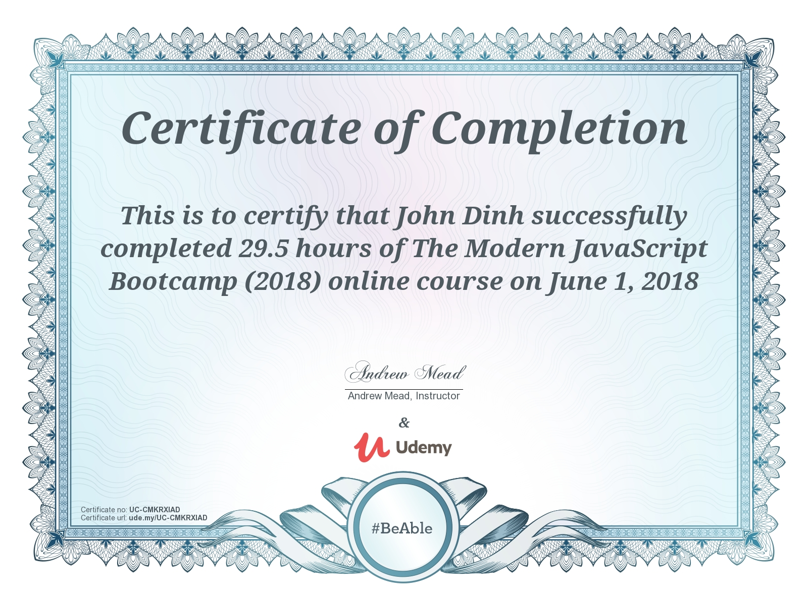

<h1>Welcome To My Udemy Course Journey</h1>

<h2>The Complete Web Developer in 2018: Zero to Mastery</h2>

In this repository, I will upload all the major projects that I would have to do in the course.
This is more of just "proof" that I have done the work to earn my certification in the course.

<h1>Contact Me For Help!!!</h1>

If you are also taking this course and need some help or don't understand something, please feel free to contact me
on the discord channel. My discord is 'JayDinh#0891' <strong>Please be aware that discord usernames are CASE SENSITIVE</strong>

<h4>Good News! Update 12/9/18</h4>

I will be comming back and retaking this entire course! Expect a bunch of updates over the next couple of weeks for updated exercices and project solutions. Don't forget to contact me on Discord if you need any help

<h4>Update 6/2/18</h4>

I hate to say this but I'm really dissapointed with this course. There is a ton of information to learn which is good! But the way it is taught is horrible in my opinion. The reason I can say this is because I have over 50 web development Udemy course (yup over 50) and I found the teaching style in this course was not even close to being on par with the other instructors. I just want to keep this honest, instead of lying to people and saying "This is such a good course because of all the reviews and people taking it!". I will periodically come back to this course and upload all the "big projects" on this repository. Although I will be skipping over Andrei's small exercises, I will include the Udemy courses I believe are <strong>way much better</strong> than this one in terms of teaching. As of now, I have substituted all of Andrei's JavaScript with the following Udemy course below. It covers all of the topic Andrei touches but is by far, better taught in my opinion.

